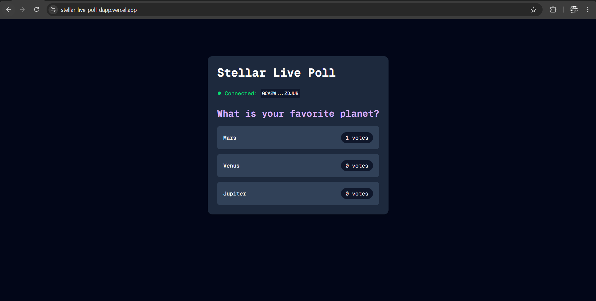

# Stellar Live Poll dApp

A decentralized voting application built on Stellar Soroban.

## Project Description
This project demonstrates a full-stack dApp on Soroban. Users can connect their Freighter wallet to vote on a live poll stored on the smart contract. The application provides real-time updates of the vote counts.

## Contract Details
- **Network**: Testnet
- **Contract ID**: `CD3FMPVW6CAOJTT7EQTC6U46FXMH5QIWLNA7MA4USTBIB7HM2PNMOWTG`
- **Functions**: `init_poll`, `vote`, `get_poll`

## Setup Instructions

### Prerequisites
- Node.js & npm
- Freighter Wallet Extension

### Installation
1. Clone the repository.
2. Navigate to the `frontend` directory:
   ```bash
   cd frontend
   ```
3. Install dependencies:
   ```bash
   npm install
   ```
4. Run the development server:
   ```bash
   npm run dev
   ```
5. Open [http://localhost:3000](http://localhost:3000) with your browser.

## How to Use
1. **Connect Wallet**: Click the "Connect Freighter" button.
2. **View Poll**: The current question and options will load automatically.
3. **Vote**: Click on an option to cast your vote. You will be prompted to sign the transaction.
4. **Real-time Updates**: The vote counts verify updates automatically every 5 seconds.

## Project Structure
- `contracts/`: Soroban smart contract (Rust)
- `frontend/`: Next.js React application

## Screenshots


## Submission Details
- **Deployed Contract Address**: `CD3FMPVW6CAOJTT7EQTC6U46FXMH5QIWLNA7MA4USTBIB7HM2PNMOWTG`
- **Transaction Hash**: [79ac7cecbb179fa4e50a3fdf1db57e079ca4098910ead3900da47b3d4de728fd]
- **Repository Link**: [https://github.com/efekrbas/stellar-live-poll-dapp]
- **Live Demo**: [https://stellar-live-poll-dapp.vercel.app/]
