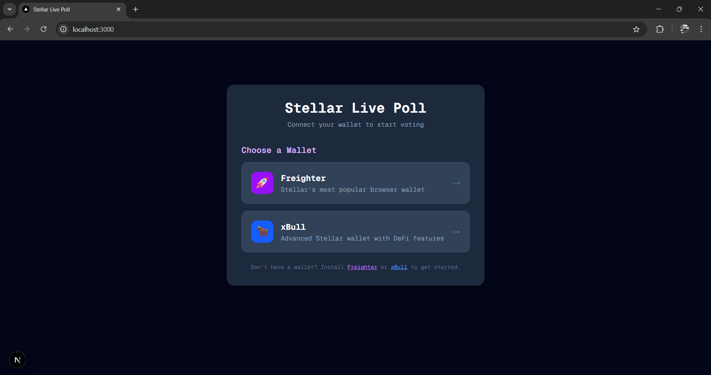

# Stellar Live Poll dApp

A decentralized voting application built on Stellar Soroban with multi-wallet support.

## Project Description
This project demonstrates a full-stack dApp on Soroban. Users can connect their wallet (Freighter or xBull) to vote on a live poll stored on the smart contract. The application provides real-time updates of the vote counts and full transaction status tracking.

## Features
- **Multi-Wallet Support**: Connect via Freighter or xBull wallet
- **Real-Time Updates**: Integration with Soroban Events for live vote tracking
- **Transaction Status Tracking**: Pending, success, and error states displayed in real-time
- **Error Handling**: 3 distinct error types — Already Voted, Poll Ended, Network Errors
- **On-Chain Voting**: All votes are recorded on the Stellar testnet blockchain

## Contract Details
- **Network**: Testnet
- **Contract ID**: `CD3FMPVW6CAOJTT7EQTC6U46FXMH5QIWLNA7MA4USTBIB7HM2PNMOWTG`
- **Functions**: `init_poll`, `vote`, `get_poll`
- **Error Codes**: `#1` NotInitialized, `#2` PollEnded, `#3` AlreadyVoted

## Setup Instructions

### Prerequisites
- Node.js & npm
- Freighter Wallet Extension or xBull Wallet Extension

### Installation
1. Clone the repository.
2. Navigate to the `frontend` directory:
   ```bash
   cd frontend
   ```
3. Install dependencies:
   ```bash
   npm install
   ```
4. Run the development server:
   ```bash
   npm run dev
   ```
5. Open [http://localhost:3000](http://localhost:3000) with your browser.

## How to Use
1. **Select Wallet**: Choose between Freighter or xBull wallet from the wallet selection screen.
2. **Connect Wallet**: Click "Connect" to authorize the application.
3. **View Poll**: The current question and options will load automatically.
4. **Vote**: Click on an option to cast your vote. You will be prompted to sign the transaction.
5. **Track Transaction**: Watch the transaction status change from pending → success/error in real-time.
6. **Real-time Updates**: The vote counts update automatically every 5 seconds.

## Project Structure
- `contracts/`: Soroban smart contract (Rust)
  - `live_poll/src/lib.rs`: Smart contract with init_poll, vote, get_poll
  - `live_poll/Cargo.toml`: Contract dependencies
- `frontend/`: Next.js React application
  - `app/components/LivePoll.tsx`: Main voting component with multi-wallet support

## Screenshots


## Submission Details
- **Deployed Contract Address**: `CD3FMPVW6CAOJTT7EQTC6U46FXMH5QIWLNA7MA4USTBIB7HM2PNMOWTG`
- **Transaction Hash**: [79ac7cecbb179fa4e50a3fdf1db57e079ca4098910ead3900da47b3d4de728fd](https://stellar.expert/explorer/testnet/tx/79ac7cecbb179fa4e50a3fdf1db57e079ca4098910ead3900da47b3d4de728fd)
- **Repository Link**: [https://github.com/efekrbas/stellar-live-poll-dapp](https://github.com/efekrbas/stellar-live-poll-dapp)
- **Live Demo**: [https://stellar-live-poll-dapp.vercel.app/](https://stellar-live-poll-dapp.vercel.app/)
